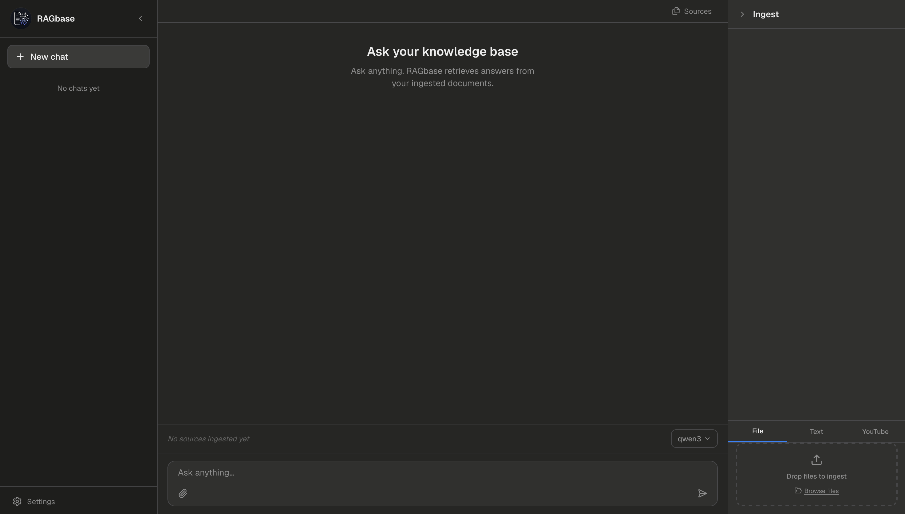

# RAGbase

> Local AI knowledge base - chat with your notes, PDFs, and videos.
> Runs entirely on your machine, no cloud APIs required.



## What it does

RAGbase ingests your documents — notes, PDFs (typed or handwritten), images,
videos, and YouTube links — and lets you chat with all of them at once. Answers
are grounded in your own content with source citations, so you can see exactly
where every claim came from. Everything runs locally through Ollama: your
documents and questions never leave your machine.

## Features

- PDF ingestion (typed and handwritten via VLM transcription)
- Image, video, YouTube, and plain text ingestion
- Hybrid BM25 + vector search with cross-encoder reranking
- Knowledge graph for cross-document concept linking
- Streaming answers with source citations
- Multi-turn chat with context window management
- Clipboard paste — images and long text automatically become attachments
- Dark/light mode, PDF preview, drag-and-drop ingestion

## Requirements

- Mac (Apple Silicon recommended) or Linux
- Windows via WSL2 should work but is untested
- **[Ollama](https://ollama.ai/download)** — local model inference engine
- **Python 3.11+** — [python.org](https://www.python.org/downloads/)
- **Node.js 18+** — [nodejs.org](https://nodejs.org/)

## Setup

### 1. Install Ollama

Download and install Ollama from [ollama.ai/download](https://ollama.ai/download).

On Mac, drag it to Applications and launch it. You should see the Ollama icon in your menu bar.

On Linux:
```bash
curl -fsSL https://ollama.com/install.sh | sh
```

### 2. Install Python 3.11+

Check if you already have it:
```bash
python3 --version
```

If not, download from [python.org](https://www.python.org/downloads/) or on Mac via Homebrew:
```bash
brew install python@3.13
```

### 3. Install Node.js 18+

Check if you already have it:
```bash
node --version
```

If not, download from [nodejs.org](https://nodejs.org/) or on Mac via Homebrew:
```bash
brew install node
```

### 4. Clone and install RAGbase

```bash
git clone https://github.com/tlayers21/ragbase
cd ragbase
bash scripts/install.sh
```

`install.sh` will:
- Check all prerequisites are installed
- Pull all required Ollama models (~14GB total, one-time download)
- Set up the Python virtual environment and install dependencies
- Install frontend dependencies and build the production frontend

This takes 20-40 minutes on first run depending on your internet speed — mostly
waiting for model downloads.

### 5. Start RAGbase

```bash
bash scripts/start.sh
```

This starts the backend and frontend, then opens your browser to `localhost:3000`.
On subsequent runs `start.sh` checks for updates automatically and only rebuilds
the frontend if something changed — startup is fast after the first run.

## Updating

```bash
git pull origin main
bash scripts/start.sh
```

`start.sh` handles pulling updates and rebuilding automatically on each launch.

## How it works

A FastAPI backend orchestrates ingestion and retrieval. Documents are chunked
and embedded into ChromaDB (embedded, in-process — no server to run), a SQLite
knowledge graph links concepts across documents, and a Next.js frontend
provides the chat UI. All AI — generation, embeddings, vision, reranking —
runs locally through Ollama. No Docker, no internet required after setup.

## Model stack

| Task | Model |
|------|-------|
| Answer generation | qwen3 (8B) |
| Summarize, entity extraction, text cleanup | qwen2.5:3b |
| Vision — handwriting, diagrams, images | qwen2.5vl |
| Embeddings | bge-m3 |
| Reranking | BAAI/bge-reranker-v2-m3 |
| Audio transcription | Whisper base |
| OCR (standalone images) | PaddleOCR |
| OCR (typed PDFs) | RapidOCR via Docling |

**Total model footprint: ~15GB**

## Hardware

Apple Silicon (M1/M2/M3/M4) is strongly recommended — all models run on the
MPS GPU which is significantly faster than CPU. Intel Mac and Linux with an
Nvidia GPU also work well. CPU-only will work but responses will be slow
(30-120 seconds per query depending on hardware).

Minimum recommended: 16GB RAM. 24GB+ for comfortable use with all models loaded.

## Privacy

RAGbase sends anonymous usage telemetry by default: query latency, source
counts, and a random device ID (e.g. `dev_a3f9b2c1`) that cannot be linked to
you. Your queries, documents, and personal data are **never** sent — they never
leave your machine. You can disable telemetry entirely with the toggle in
**Settings → Send anonymous usage telemetry**.

## Resetting

To wipe all ingested data and start fresh:
```bash
bash scripts/reset_all.sh
```

This clears ChromaDB, the knowledge graph, the semantic cache, all source files,
and chat history. Models are not affected.

## Directory structure

```
ragbase/
├── main.py        FastAPI entry point and startup lifecycle
├── config/        Settings, model routing, paths, logging
├── ingestion/     PDF/image/video/YouTube/text ingestors + job queue
├── retrieval/     Hybrid search, reranker, knowledge graph, DSPy pipeline
├── analysis/      Fact checking and contradiction detection
├── api/           FastAPI routers (ingest, query, documents, settings, ...)
├── ml/            Eval and fine-tuning scripts
├── utils/         ChromaDB client, Ollama client, cache, telemetry
├── frontend/      Next.js app (TypeScript, Tailwind)
├── scripts/       install.sh, start.sh, reset_all.sh, status.sh
└── data/          Local data: ChromaDB, cache, source files (gitignored)
```

## License

MIT